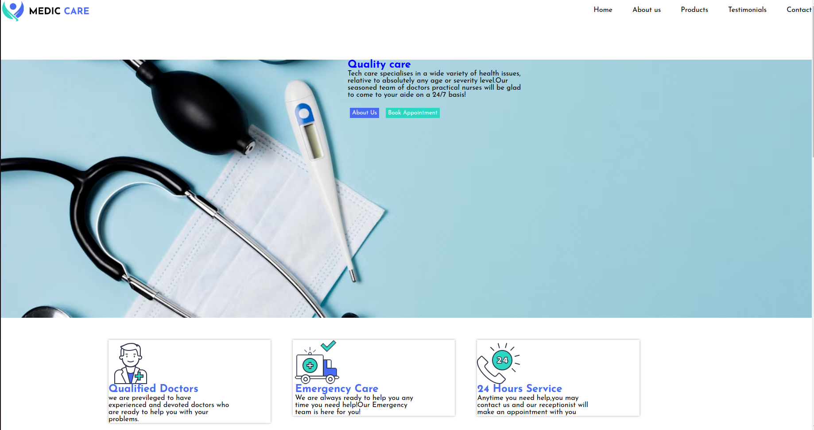
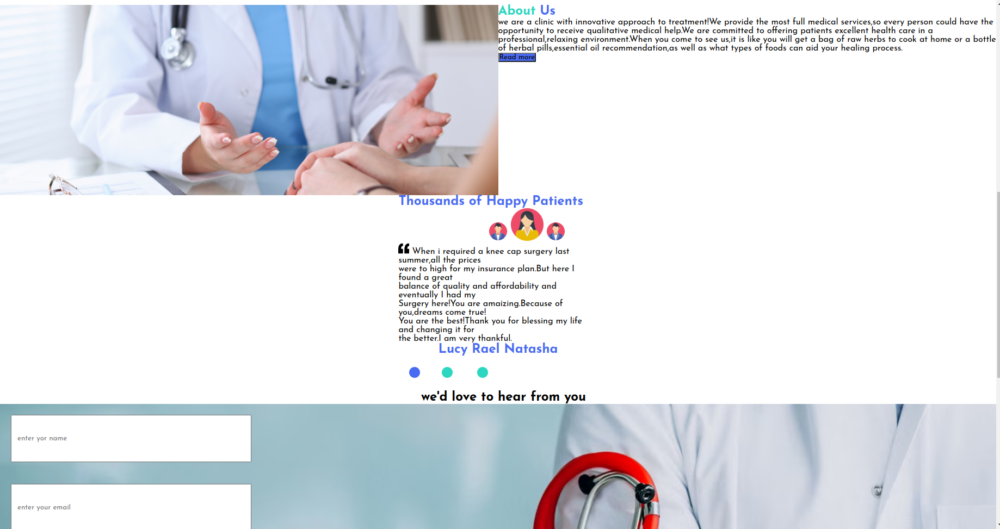
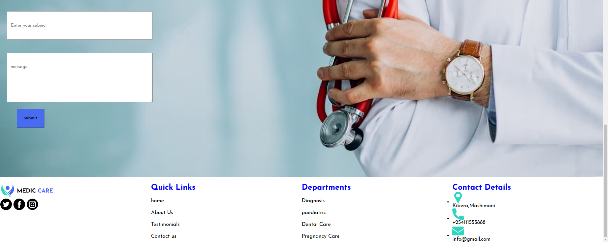

# medic-care-clinic #
## project description ##
it is a website that people can visit to get to know the treatment and services offered with the clinic.
# descriptive link #
To access the project live use the [link](http://https://https://lumwachi25418.github.io/mediccare/)
# screenshots #
This how the project looks like:

This is the  header part of the home-page;

This is the hero part of the home-page

This is the footer part of the home-page

## Technologies used ##
* html
*css
*
## project setup and installation
1.  Open the terminal and navigate to where you want to store the project eg
  `cd desktop`
2.  to clone the project on the terminal `git clone https://github.com/lumwachi25418/mediccare.git`
3. use `cd medic care-clinic` to enter the directory

# contact #
to be get in touch with me email me at ** lumwachiemmanuel18@gmail.com ** 

# license #

MIT License

Copyright (c) [***2024**] [***Emmanuel lumwachi***]

Permission is hereby granted, free of charge, to any person obtaining a copy
of this software and associated documentation files (the "Software"), to deal
in the Software without restriction, including without limitation the rights
to use, copy, modify, merge, publish, distribute, sublicense, and/or sell
copies of the Software, and to permit persons to whom the Software is
furnished to do so, subject to the following conditions:

The above copyright notice and this permission notice shall be included in all
copies or substantial portions of the Software.

THE SOFTWARE IS PROVIDED "AS IS", WITHOUT WARRANTY OF ANY KIND, EXPRESS OR
IMPLIED, INCLUDING BUT NOT LIMITED TO THE WARRANTIES OF MERCHANTABILITY,
FITNESS FOR A PARTICULAR PURPOSE AND NONINFRINGEMENT. IN NO EVENT SHALL THE
AUTHORS OR COPYRIGHT HOLDERS BE LIABLE FOR ANY CLAIM, DAMAGES OR OTHER
LIABILITY, WHETHER IN AN ACTION OF CONTRACT, TORT OR OTHERWISE, ARISING FROM,
OUT OF OR IN CONNECTION WITH THE SOFTWARE OR THE USE OR OTHER DEALINGS IN THE
SOFTWARE.